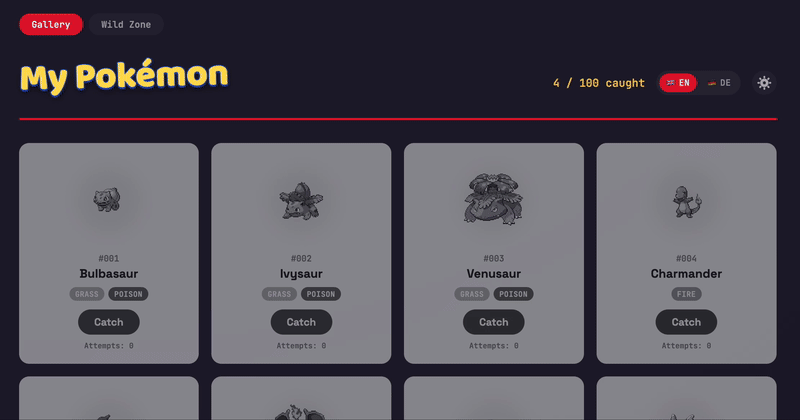

# Pokemon Catching Game & Tracker

A small full-stack project for learning agentic coding workflows: a Node/Express
backend with a SQLite database, paired with a React (Vite) frontend. Users see
a grid of Pokemon "cards" and can attempt to catch them — each Pokemon has its own
catch rate, derived from its base experience (rarer/stronger Pokemon are
harder to catch). Later on: More realistic "catching" using Pokéball


## Demo
 



## Features

- Two modes: **Gallery** (grid view with sprites, names, type badges) and
  **Wild Zone** (Pokemon roam a sky/grass/water scene and must be clicked
  to catch)
- Three Poke Ball types (Poke Ball / Super Ball / Master Ball) with limited
  counts that refill on a timer; ball choice affects catch odds
- Custom ball cursor with a glow around Pokemon that can currently be caught
- Pokemon detail view with official artwork and base stats
- Catch mechanic: a random roll against a per-Pokemon catch rate
- Persistent progress, stored in SQLite
- Settings menu: adjustable Wild Zone speed and ball refill interval
- English / German language toggle, including localized Pokemon names
  (fetched from the PokeAPI)

## Tech Stack

| Layer    | Technology                        |
| -------- | ---------------------------------- |
| Backend  | Node.js, Express, better-sqlite3   |
| Frontend | React, Vite                        |
| Data     | [PokeAPI](https://pokeapi.co/) (base data, imported once) |

## Project Structure

```
pokemon-fang-tracker/
├── backend/
│   ├── server.js              # Express entry point
│   ├── db.js                  # SQLite connection + schema
│   ├── routes/pokemon.js      # GET /api/pokemon, POST /api/pokemon/:id/catch
│   └── scripts/import-pokemon.js  # one-time import from the PokeAPI
├── frontend/
│   └── src/
│       ├── App.jsx                     # top-level state, language toggle, tabs
│       ├── api.js                      # backend fetch calls
│       ├── i18n.js                     # EN/DE translations
│       └── components/
│           ├── PokemonCard.jsx         # Gallery grid card
│           ├── PokemonDetailModal.jsx  # Pokemon detail/stats view
│           ├── WildZone.jsx            # roaming-Pokemon catch mode
│           ├── BallSelector.jsx        # Poke/Super/Master Ball picker
│           └── SettingsMenu.jsx        # speed & refill settings
└── CLAUDE.md                   # project context for Claude Code
```

## Getting Started

### 1. Backend

```bash
cd backend
npm install
npm run import   # one-time: fetch Pokemon data from the PokeAPI into SQLite
npm run dev       # starts the API on http://localhost:3001
```

### 2. Frontend

In a second terminal:

```bash
cd frontend
npm install
npm run dev       # starts the app on http://localhost:5173
```

Open `http://localhost:5173` in your browser. The backend must be running for
the app to load any data.

## API Reference

| Method | Route                     | Description                          |
| ------ | -------------------------- | ------------------------------------- |
| GET    | `/api/pokemon`             | List all Pokemon with catch status    |
| POST   | `/api/pokemon/:id/catch`   | Attempt to catch a Pokemon            |
| GET    | `/api/health`               | Health check                          |

## AI-Assisted Development

This project was built with the help of Claude (Anthropic) — used for
architecture planning, code generation, and debugging. The [`CLAUDE.md`](./CLAUDE.md)
file in this repo documents the project context and conventions given to the
assistant, kept up to date as the project evolves.

## License

Personal learning project — no license specified.
